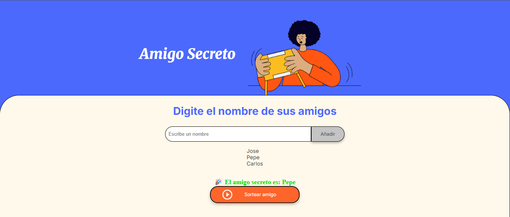

# 🎁 Amigo Secreto

Aplicación web sencilla desarrollada con **HTML**, **CSS** y **JavaScript** que permite organizar un sorteo de *Amigo Secreto*.  
El usuario puede ingresar nombres de amigos en una lista y luego realizar un sorteo aleatorio para determinar quién es el amigo secreto.

---

## 🚀 Funcionalidades
- Agregar nombres a una lista mediante un campo de texto y un botón.
- Validación: no permite agregar nombres vacíos.
- Visualización de la lista de amigos ingresados.
- Sorteo aleatorio de un nombre con un solo clic.

---

## 📸 Capturas de pantalla

### Pantalla principal


### Ejemplo de lista


## 🛠️ Tecnologías usadas

- **HTML5**
- **CSS3**
- **JavaScript**

---

## ▶️ Cómo usarlo
1. Clonar este repositorio:
   ```bash
   git clone https://github.com/TU_USUARIO/amigo-secreto.git
